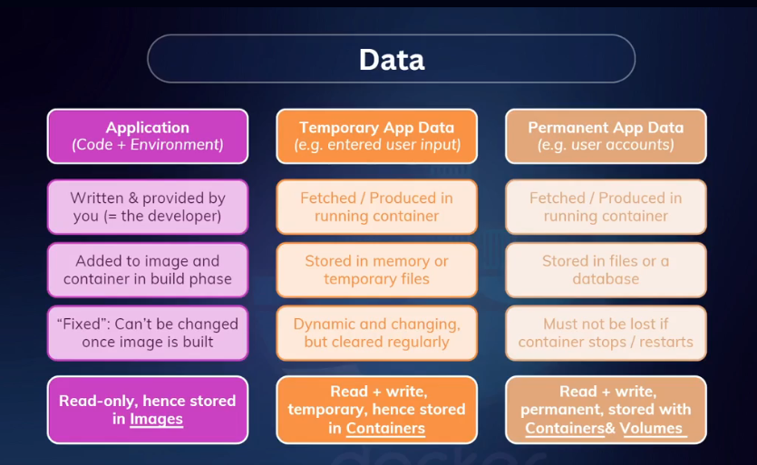

# DOCKER-VOLUMES-AND-MANAGING-DATA

## Bind Mount, Dev Container & Ts Node Dev Cheat Sheet

## Bind Mound Syntax For

<aside>
💡

For Git Bash

```jsx
docker run -p 5000:5000 --name ts-container -w //app -v ts-docker-logs://app/logs -v "//$(pwd)"://app/ -v //app/node_modules --rm ts-docker
```

</aside>

<aside>
💡

For Powershell

```jsx
docker run -p 5000:5000 --name ts-container -w //app -v ts-docker-logs://app/logs -v "${PWD}://app" -v //app/node_modules --rm ts-docker
```

</aside>

<aside>
💡

For CMD

```jsx
docker run -p 5000:5000 --name ts-container -w //app -v ts-docker-logs://app/logs -v "%cd%"://app/ -v //app/node_modules --rm ts-docker
```

</aside>

ts-node-dev command for Docker Container

<aside>
💡

ts-node-dev --respawn --transpile-only --poll src/server.ts

</aside>

1. First Open A  .devcontainer folder in the root of the project
2. Inside the .devcontainer folder open a file named devcontainer.json and paste the following code
3. Change the json name, container names and file directories according to your project

```jsx
{
  "name": "ts-container",
  "image": "node:20",
  "workspaceFolder": "/app",
  "mounts": [
    // Bind mount for your local project
    "source=/c/Projects/next-level/Docker/docker-with-typescipt-backend,target=/app,type=bind",

    // Named volume for logs (similar to: -v ts-docker-logs://app/logs)
    "source=ts-docker-logs,target=/app/logs,type=volume",

    // Anonymous volume for node_modules (similar to: -v //app/node_modules)
    "target=/app/node_modules,type=volume"
  ],
  "runArgs": [
    "--name",
    "ts-container",
    "-p",
    "5000:5000",
    "--rm" // Automatically remove the container after exiting VS Code
  ],
  "postCreateCommand": "npm install"
}
```


Bind Mount, Dev Container & Ts Node Dev Cheat Sheet:

https://find-saminravi99.notion.site/Bind-Mount-Dev-Container-Ts-Node-Dev-Cheat-Sheet-117c48b8ac8c804aabb5ed0f09bc69a9?pvs=4


GitHub Link:

https://github.com/Apollo-Level2-Web-Dev/docker-with-typescript-backend/tree/module-3

## 3-1 Understanding Data Categories

### Primary Data
- Data management means managing data in a way that ensures its availability, reliability, and security throughout its lifecycle. It involves processes and practices for collecting, storing, organizing, and maintaining data effectively.
- Application Environment size (code+environment) is called `Primary Data For Docker`
- Container has its own internal file system but the image has no file system. thats why image is read only and container is read write.

### Temporary Data 
- Temporary data refers to data that is generated or used temporarily during the operation of an application or system. This type of data is often volatile and may be deleted or overwritten once it is no longer needed.
- In the context of Docker, temporary data can be managed using anonymous volumes or tmpfs mounts, which provide a way to store data that exists only for the duration of the container's lifecycle.
- permanent data is stored in named volumes or bind mounts, while temporary data can be stored in anonymous volumes or tmpfs mounts. suppose we want to change code and directly add in container. the image is not gonna get the code. If we delete the container the changes will be deleted right? but we want the file is gonna be there even if we delete the container. so we use bind mount or named volume for that.




## 3-2 Analyzing A Real App

- logger is a kind of thing that we can observe the application logs even after deployed in live. in the project we have used a package called winston for logging. and the system is made like that if any error occurs it will create a file based on the html file and save it permanently. we will see the error lits and debug in development phase

